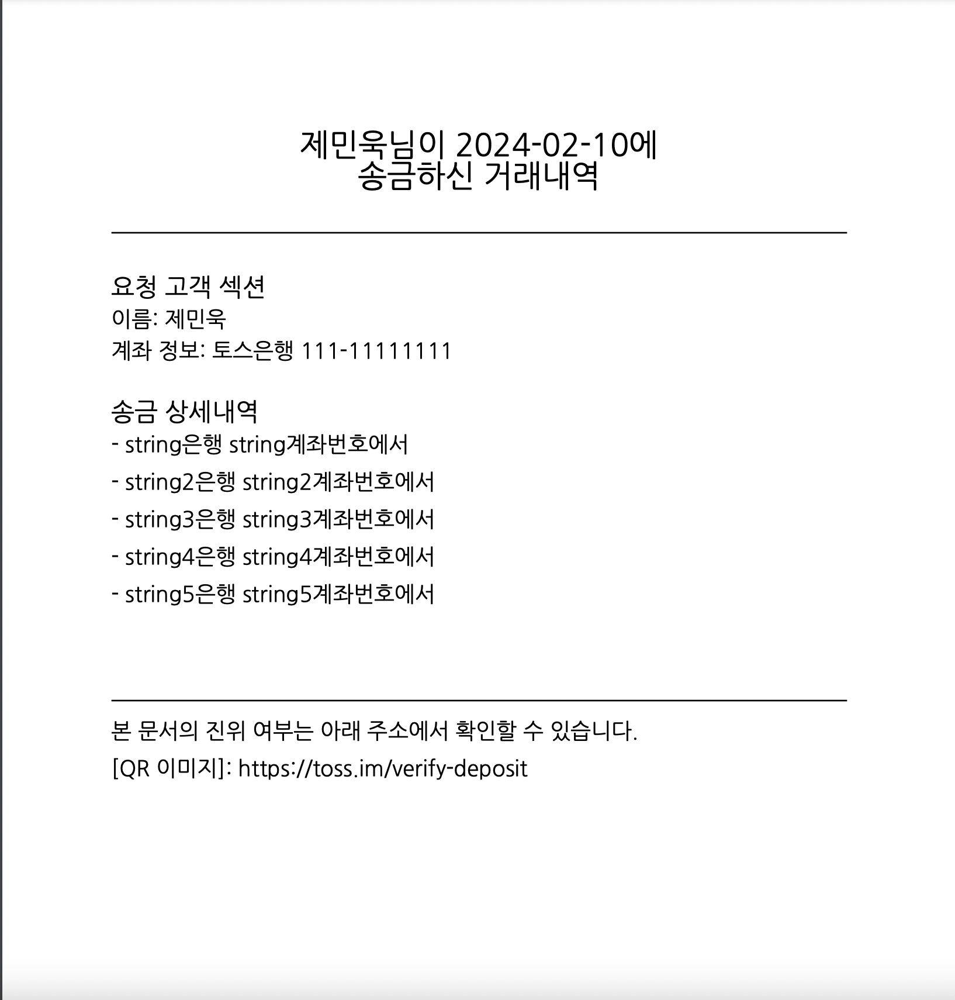
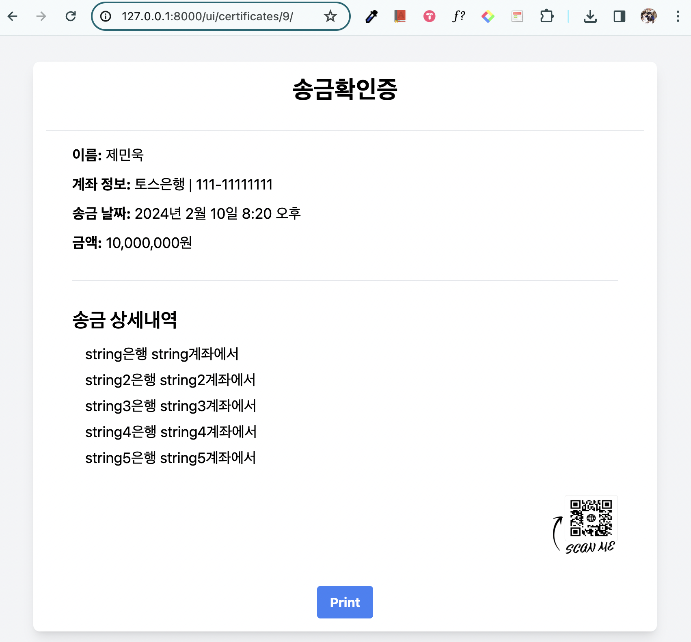
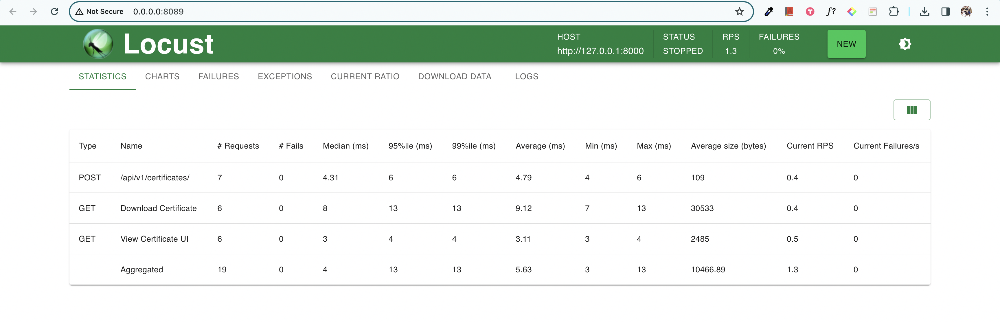

# banking transfer

## setup
```
pyenv local 3.11.4

poetry env use python
poetry config virtualenvs.in-project true
poetry install
poetry shell
```

## cli

```
# run 
make run

# swagger 
http://127.0.0.1:8000/swagger/

# migrate
make migrate

# test
make test

# load test
# before call it, $ make run first
make locust
```

## download 

- http://127.0.0.1:8000/api/v1/certificates/<CERTIFICATE_ID>/download/?type=pdf



## ui

http://127.0.0.1:8000/ui/certificates/<CERTIFICATE_ID>/



## load test


